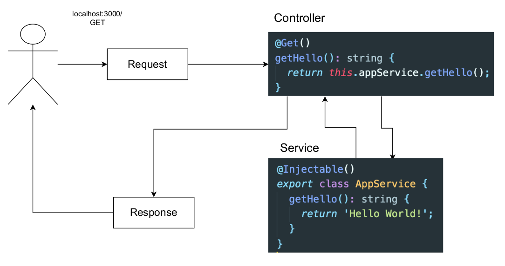
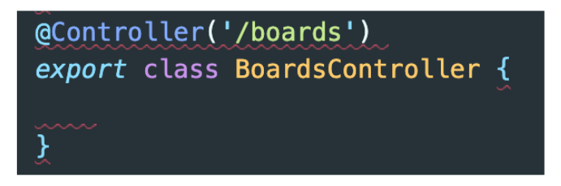
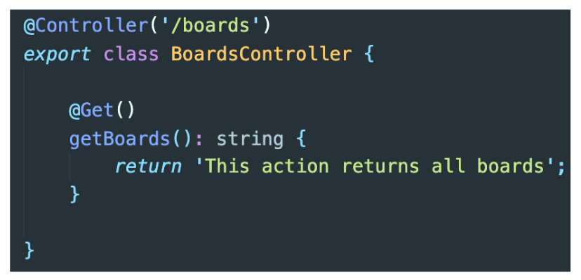
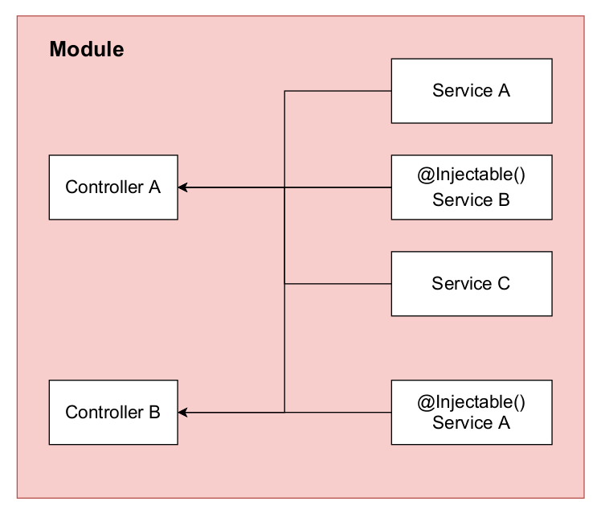

# Section 2. NestJS 기본 요소

## 게시물 CRUD 애플리케이션 소개

만들고자 하는 애플리케이션의 전체적인 구조는 다음과 같다.

- AppModule(root)
  - BoardModule
    - BoardController
    - BoardEntity
    - BoardService
    - BoardRepository
    - ValidationPipe
  - AuthModule
    - AuthController
    - UserEntity
    - AuthService
    - UserRepository
    - JWT, Passport

## NestJS의 기본 구조

NestJS 프로젝트를 생성했을 때 존재하는 기본적인 파일들의 역할은 다음과 같다.

- **.eslintrc.js**: 개발자들이 특정한 규칙 하에 코드를 깔끔하게 작성할 수 있도록 도와주는 라이브러리이다. 타입스크립트 가이드라인을 제시하거나 문법적인 오류를 알려주는 등의 역할을 한다.
- **.prettierrc**: 주로 코드 형식을 맞추는 데 사용한다. 따옴표 종류, indentation 등의 코드 포맷팅 역할을 한다.
- **nest-cli.json**: nest 프로젝트를 위한 특정 설정을 할 수 있는 json 파일이다.
- **tsconfig.json**: 타입스크립트 컴파일 방식을 설정한다.
- **tsconfig.build.json**: 타입스크립트 빌드 시 필요하거나 필요하지 않은 설정들을 명시한다.
- **package.json**: "build"는 운영 환경을 위한 빌드, "format"은 린트 에러를 수정, "start"는 앱을 시작하는 명령어이다.
- **src/**
  - **main.ts**: 앱을 생성하고 실행한다.
  - **app.module.ts**: 앱 모듈을 정의한다.

## NestJS의 기본적인 흐름



1. 클라이언트 요청이 발생하면 컨트롤러가 호출된다.
2. 서버 컨트롤러는 서비스 로직을 호출하고 그 결과를 반환한다.
3. 반환된 값이 클라이언트에게 응답된다.

## NestJS Module

실습으로 만들 애플리케이션은 AppModule, BoardModule, AuthModule로 구성된다.

모듈은 `@Module()` 데코레이터가 달린 클래스이다. 데코레이터를 사용해 NestJS가 애플리케이션 구조를 만들 수 있도록 메타데이터를 제공한다. 모든 NestJS 응용 프로그램에는 하나 이상의 모듈(앱 모듈)이 존재하고, 앱 모듈은 NestJS가 시작점으로 사용하는 모듈이다.

또한, 모듈은 밀접하게 관련된 기능의 집합으로써 애플리케이션의 구성 요소를 이루게 된다. 유저 모듈, 챗 모듈, 주문 모듈 등 기능별로 모듈을 구성한다. 같은 기능에 해당하는 것들은 모두 하나의 모듈 디렉터리 안에서 관리한다. 예를 들어 UserController, UserService, UserEntity는 모두 같은 기능이기에 UserModule 안에서 관리한다.

모듈은 기본적으로 싱글톤이기 때문에 여러 모듈 간에 동일한 인스턴스를 공유할 수 있다.

## Board Module 생성하기

가장 먼저 Board Module을 생성할 것이다. 처음부터 하나씩 만들어가기 위해 프로젝트의 test 디렉터리 및 기본적인 controller, service 파일을 삭제한다. 그리고 NestJS CLI를 사용해 모듈을 생성한다.

```
$ nest g module boards
```

- **nest**: using nestcli
- **g**: generate
- **module**: schematic that I want to create
- **boards**: name of the schematic

**src/boards/boards.module.ts**
```
import { Module } from '@nestjs/common';

@Module({})
export class BoardsModule {}
```

명령어를 통해 생성된 모듈 파일을 사용하기 위해선 루트 모듈인 `app.module.ts`에 등록해 주어야 한다. CLI를 통해 생성된 모듈은 자동적으로 등록된다.

## NestJS Controller

### Controller



컨트롤러는 들어오는 요청을 처리하고 클라이언트에게 응답을 반환한다. 컨트롤러는 `@Controller()` 데코레이터로 클래스를 데코레이션하여 정의된다. 데코레이터의 인자는 컨트롤러에 의해 처리되는 경로이다.

### Handler



핸들러는 `@Get`, `@Post`, `@Delete` 등과 같은 데코레이터로 데코레이션되는 컨트롤러 클래스 내의 메서드이다.

## Board Controller 생성하기

이제 게시판 애플리케이션에서 사용자 요청에 따라 서비스 로직을 처리하고 응답을 반환해줄 수 있는 컨트롤러를 생성할 것이다. 다음과 같은 CLI 명령어로 boards 컨트롤러를 생성한다.

```
$ nest g controller boards --no-spec

CREATE src/boards/boards.controller.ts (101 bytes)
UPDATE src/boards/boards.module.ts (174 bytes)
```

- **nest**: using nestcli
- **g**: generate
- **controller**: controller schematic
- **boards**: name of the schematic
- **--no-spec**: do not generate any code for test

**src/boards/boards.controller.ts**
```
import { Controller } from '@nestjs/common';

@Controller('boards')
export class BoardsController {}
```

CLI 명령어로 컨트롤러 생성 시 CLI가 수행하는 일은 다음과 같다.

1. boards 디렉터리를 탐색한다.
2. boards 디렉터리 안에 컨트롤러 파일을 생성한다.
3. boards 디렉터리 안에서 모듈 파일을 탐색한다.
4. 모듈 파일에 컨트롤러 정보를 기록한다.

## NestJS Providers, Service

### Provider



프로바이더는 NestJS의 기본 개념으로 서비스, 리포지토리, 팩토리, 헬퍼 등 대부분의 기본적인 Nest 클래스는 프로바이더로 취급될 수 있다. 프로바이더의 특징은 종속성을 주입할 수 있다는 것이다. 객체 간에 다양한 관계를 만들 수 있으며 객체의 인스턴스를 연결하는 역할은 대부분 Nest 런타임 시스템에 위임된다.

### Service

서비스란 소프트웨어 개발에서 사용되는 공통적인 개념이다. NestJS에서는 `@Injectable()` 데코레이터로 데코레이션되어 모듈에 제공되며, 이 서비스 인스턴스는 생성된 모듈 밖의 애플리케이션 전체에서 사용될 수 있다. 서비스는 주로 컨트롤러에 전달된 클라이언트 데이터의 유효성 검사를 하거나, 데이터베이스를 조작하는 등의 역할을 담당한다.

### Dependency Injection: 서비스를 컨트롤러에서 사용할 수 있는 방법

**src/app.controller.ts**
```
import { Controller, Get } from '@nestjs/common';
import { AppService } from './app.service';

@Controller()
export class AppController {
  constructor(private appService: AppService) {}

  @Get()
  getHello(): string {
    return this.appService.getHello();
  }
}
```

위 코드와 같이 NestJS의 초기 생성된 컨트롤러에서는 `this.appService.getHello()`와 같이 서비스에 정의해 놓은 메서드를 호출한 바 있다. 서비스를 컨트롤러의 생성자로 가져오고 있는데 이것을 컨트롤러에 서비스가 의존성 주입되었다고 말한다. 이처럼 서비스를 별도로 정의한 후 컨트롤러에서 사용할 수 있다. 이는 타입스크립트의 기능을 이용해 종속성을 타입으로 해결할 수 있기 때문이다.

### Provider 등록하기

프로바이더를 사용하기 위해선 Nest의 모듈 파일에 등록해 주어야 한다. 데코레이터 인자로 프로바이더를 제공할 수 있다.

## Board Service 생성하기

이제 게시판 애플리케이션을 위한 서비스를 CLI를 사용해 생성한다. 다음과 같이 입력한다.

```
$ nest g service boards --no-spec
CREATE src/boards/boards.service.ts (90 bytes)
UPDATE src/boards/boards.module.ts (255 bytes)
```

- **nest**: using nestcli
- **g**: generate
- **service**: service schematic
- **boards**: name of the schematic
- **--no-spec**: do not generate any code for test

**src/boards/boards.service.ts**
```
import { Injectable } from '@nestjs/common';

@Injectable()
export class BoardsService {}
```

위와 같이 서비스 파일이 생성된다. 서비스 클래스는 `@Injectable()`이라는 데코레이터가 있는데, 이는 **의존성 주입이 가능하다**는 의미이다. NestJS는 이것을 이용해 다른 컴포넌트에서 이 서비스를 사용(주입)할 수 있게 만들어준다.

서비스 역시 모듈에 등록되어야 사용할 수 있는데, CLI로 서비스를 생성하면 다음과 같이 모듈 파일에 자동으로 기록된다.

**src/boards/boards.module.ts**
```
import { Module } from '@nestjs/common';
import { BoardsController } from './boards.controller';
import { BoardsService } from './boards.service';

@Module({
  controllers: [BoardsController],
  providers: [BoardsService],
})
export class BoardsModule {}
```

### Dependency Injection: Board Service를 Board Controller에서 사용할 수 있게 해주기

**src/boards/boards.controller.ts**
```
import { Controller } from '@nestjs/common';
import { BoardsService } from './boards.service';

@Controller('boards')
export class BoardsController {
  constructor(private boardsService: BoardsService) {}  // Dependency Injection
}
```

NestJS에서 Dependency Injection은 서비스를 사용하고자 하는 컨트롤러의 클래스 생성자 안에서 이루어진다.

#### 서비스 주입 코드의 원형

위 코드는 원래는 다음과 같은 코드였을 것이다.

```
import { Controller } from '@nestjs/common';
import { BoardsService } from './boards.service';

@Controller('boards')
export class BoardsController {
  boardsService: BoardsService;

  constructor(boardsService: BoardsService) {
    this.boardsService = boardsService;
  }
}
```

#### 접근 제한자를 사용한 서비스 주입 코드의 단순화

`public`, `protected`, `private`의 접근 제한자를 생성자 파라미터에 선언하면 이는 암묵적으로 클래스 프로퍼티로 선언된다. 그렇기 때문에 위에서 프로퍼티를 선언하고 생성자에서 대입하는 로직을 제거하고 `constructor(private boardsService: BoardsService) {}`와 같이 매우 단순하게 변경할 수 있는 것이다.