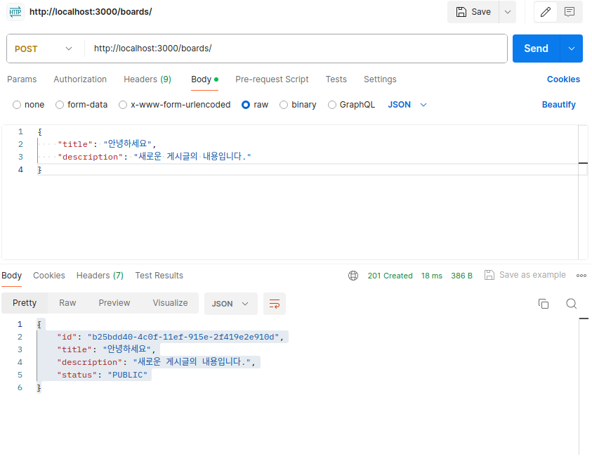

# Section 3. CRUD 구현

## 모든 게시물을 가져오는 서비스 만들기

이 로직은 데이터베이스 조작 로직이므로 서비스에서 처리할 수 있다. 우선 메모리 기반으로 작업을 시작한다.

**src/boards/boards.service.ts**
```
import { Injectable } from '@nestjs/common';

@Injectable()
export class BoardsService {
  private boards = [];

  getAllBoards() {
    return this.boards;
  }
}
```

이제 `getAllBoards()` 메서드가 실제로 호출되게 하기 위해서 컨트롤러 코드를 수정한다.

**src/boards/boards.controller.ts**
```
import { Controller, Get } from '@nestjs/common';
import { BoardsService } from './boards.service';

@Controller('boards')
export class BoardsController {
  constructor(private boardsService: BoardsService) {}

  @Get()
  getAllTask() {
    return this.boardsService.getAllBoards();
  }
}
```

서버를 실행하고 http://localhost:3000/boards에 접속하거나 포스트맨을 사용해 응답을 확인할 수 있다.

### 정리

다음과 같은 흐름으로 클라이언트의 요청이 처리되고 있다.

1. 클라이언트에서 요청을 보내면 먼저 컨트롤러가 이를 받는다.
2. 컨트롤러가 알맞은 요청 경로 및 메서드로 라우팅하여 해당 핸들러로 이동한다.
3. 세부적인 로직을 처리하기 위해 서비스를 호출한다.
4. 서비스가 로직을 처리한 후 결과를 컨트롤러에 반환한다.
5. 컨트롤러는 클라이언트에 응답을 보낸다.

## Board Model 정의하기

게시물 모델을 정의하여 게시물에 필요한 데이터를 정의한다. 먼저 **src/boards/board.model.ts**를 생성한다.

모델을 정의하기 위해 Interface 또는 Class를 사용할 수 있다. Interface는 변수의 타입만을 검사하고, Class는 변수의 타입 검사 및 인스턴스 생성까지 할 수 있다. 우선 구조를 정의하기 위해 Interface를 사용한다.

**src/boards/board.model.ts**
```
export interface Board {
  id: string;
  title: string;
  description: string;
  status: BoardStatus;
}

export enum BoardStatus {
  PUBLIC = 'PUBLIC',
  PRIVATE = 'PRIVATE',
}
```

### 생성한 Board 모델을 사용한 타이핑

정의한 모델을 사용해 서비스부터 타이핑을 시작한다.

**src/boards/boards.service.ts**
```
import { Injectable } from '@nestjs/common';
import { Board } from './board.model';

@Injectable()
export class BoardsService {
  private boards: Board[] = [];

  getAllBoards(): Board[] {
    return this.boards;
  }
}
```

그 다음으로는 컨트롤러를 타이핑한다.

**src/boards/boards.controller.ts**
```
import { Controller, Get } from '@nestjs/common';
import { BoardsService } from './boards.service';
import { Board } from './board.model';

@Controller('boards')
export class BoardsController {
  constructor(private boardsService: BoardsService) {}

  @Get()
  getAllTask(): Board[] {
    return this.boardsService.getAllBoards();
  }
}
```

이렇게 타이핑을 수행하면 코드의 가독성이 좋아지고 타입으로 인한 오류를 방지할 수 있다.

## 게시물 생성하기: Service

게시물에 관한 로직을 처리하는 것은 서비스이므로 먼저 서비스에서 로직을 생성하고 컨트롤러에서 불러와 주는 순서로 구현한다.

**src/boards/board.service.ts**
```
...
  createBoard(title: string, description: string) {
    const board: Board = {
      title,
      description,
      status: BoardStatus.PUBLIC,
    };
  }
...
```

여기서 ID를 설정하지 않았기 때문에 타입스크립트 에러가 발생한다. ID는 데이터베이스에서 고유한 값을 자동 생성해 주지만 현재는 데이터베이스 연동이 되어 있지 않은 상황이므로 `uuid`를 사용해 고유한 숫자를 부여한다. 먼저 모듈을 설치한다.

```
$ npm i uuid --save
```

이후 `import { v1 as uuid } from 'uuid'`로 모듈을 불러오고 다음과 같이 서비스 로직을 수정한다.

```
...
  createBoard(title: string, description: string): Board {
    const board: Board = {
      id: uuid(),
      title,
      description,
      status: BoardStatus.PUBLIC,
    };

    this.boards.push(board);
    return board;
  }
...
```

## 게시물 생성하기: Controller

서비스 로직을 만들었으므로 이제 컨트롤러에서 클라이언트 요청을 처리하고 응답해 주는 로직을 만든다. NestJS에서는 요청 body의 내용을 `@Body() body` 파라미터로 받아올 수 있다. 개별 속성은 `@Body('attribute') attribute`와 같이 받아올 수 있다.

**src/boards/boards.controller.ts**
```
...
  @Post()
  createBoard(
    @Body('title') title: string,
    @Body('description') description: string,
  ): Board {
    return this.boardsService.createBoard(title, description);
  }
...
```

이제 서버를 실행하고 Postman을 사용해 새롭게 만든 기능이 잘 동작하는지 테스트한다.



## Data Transfer Object(DTO)

DTO란 계층 간 데이터 교환을 위한 객체이다. 데이터베이스에서 데이터를 얻어 서비스나 컨트롤러로 전송할 때 사용하는 객체를 의미한다. DTO는 데이터가 네트워크를 통해 전송되는 방법을 정의한다. Interface나 Class를 이용해 정의할 수 있고, NestJS에서는 Class를 사용한 정의를 추천하고 있다.

DTO는 데이터 유효성 검사에 효율적이며, 타입스크립트 타입으로도 사용될 수 있어 코드를 더 안정적으로 만들어준다는 장점이 있다.

앞서 만든 서비스와 컨트롤러에서는 데이터 처리를 위해 `title`, `description`이라는 프로퍼티를 직접 명시하여 사용하였다. 그러나 애플리케이션이 복잡해지면서 이러한 프로퍼티가 수정되어야 하는 경우가 생긴다면 유지보수가 매우 힘들어질 것이다. 이러한 상황을 방지하기 위해 DTO가 사용된다.

### Interface vs. Class for DTO

인터페이스는 타입스크립트의 트랜스파일 과정 중에 제거되므로 NestJS가 런타임에 참조할 수 없다. 그러나 클래스는 자바스크립트 ES6 표준의 일부이므로 컴파일 이후에도 실제 엔티티로 유지된다. 따라서 파이프와 같은 기능이 런타임에서 원활히 사용되려면 DTO는 Class로 정의되는 것이 중요하다.

## 게시물 생성을 위한 DTO

게시물 생성 기능을 위한 DTO를 실제로 생성하고 적용해 보자. 먼저 DTO를 생성하기 위한 디렉터리와 파일을 생성한다. 먼저 **src/boards** 안에 **dto**라는 디렉터리를 생성하고 해당 디렉터리 안에 **create-board.dto.ts**를 생성한다.

**src/boards/dto/create-board.dto.ts**
```
export class CreateBoardDto {
  title: string;
  description: string;
}
```

생성된 DTO를 실제 서비스와 컨트롤러에 적용한다.

**src/boards/boards.controller.ts**
```
...
  @Post()
  createBoard(@Body() createBoardDto: CreateBoardDto): Board {
    return this.boardsService.createBoard(createBoardDto);
  }
...
```

**src/boards/boards.service.ts**
```
...
  createBoard(createBoardDto: CreateBoardDto): Board {
    const { title, description } = createBoardDto;

    const board: Board = {
      id: uuid(),
      title,
      description,
      status: BoardStatus.PUBLIC,
    };

    this.boards.push(board);
    return board;
  }
...
```

이렇게 하여 DTO를 사용해 로직의 유지보수성을 증가시켰다.

## ID로 특정 게시물 조회하기

이번에는 ID를 이용해 특정 게시물을 조회하는 기능을 구현한다. 이번에도 서비스 로직으로 주요 기능을 먼저 구현하고 컨트롤러에서 이를 연결하는 순서로 진행한다.

이번에는 요청 파라미터를 추출할 것인데, NestJS에서는 `@Param() attributes: string[]` 데코레이터로 전체 요청 파라미터를 가져올 수 있고, `@Param('attribute') attribute` 데코레이터를 사용하여 요청 파라미터의 특정 키의 값을 추출할 수 있다.

**src/boards/boards.service.ts**
```
...
  getBoardById(id: string): Board {
    return this.boards.find((board) => board.id === id);
  }
...
```

**src/boards/boards.controller.ts**
```
...
  @Get('/:id')
  getBoardById(@Param('id') id: string): Board {
    return this.boardsService.getBoardById(id);
  }
...
```

## ID로 특정 게시물 삭제하기

이번에는 ID를 사용해 특정 게시물을 삭제하는 기능을 구현한다.

**src/boards/boards.service.ts**
```
...
  deleteBoard(id: string): void {
    this.boards = this.boards.filter((board) => board.id !== id);
  }
...
```

**src/boards/boards.controller.ts**
```
...
  @Delete('/:id')
  deleteBoard(@Param('id') id: string): void {
    this.boardsService.deleteBoard(id);
  }
...
```

## 특정 게시물의 상태 업데이트하기

이번에는 특정 게시물의 상태를 PUBLIC, PRIVATE 간 업데이트해주는 기능을 구현한다.

**src/boards/boards.service.ts**
```
...
  updateBoardStatus(id: string, status: BoardStatus): Board {
    const board = this.getBoardById(id);
    board.status = status;

    return board;
  }
...
```

**src/boards/boards.controller.ts**
```
...
  @Patch('/:id/status')
  updateBoardStatus(
    @Param('id') id: string,
    @Body('status') status: BoardStatus,
  ) {
    return this.boardsService.updateBoardStatus(id, status);
  }
...
```

이렇게 메모리 기반의 저장소를 사용하여 기본적인 CRUD를 모두 구현해 보았다.