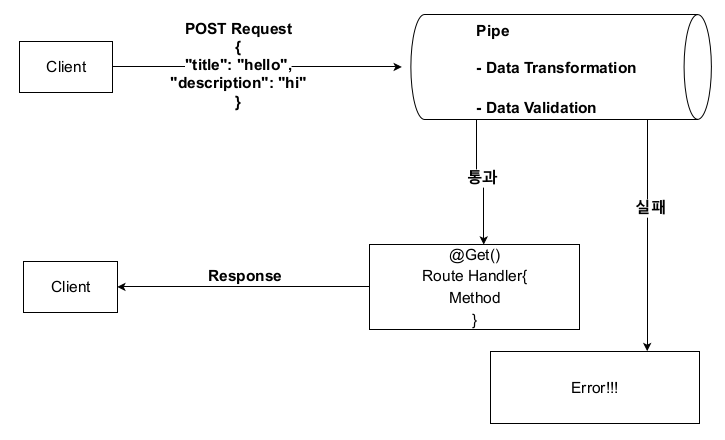
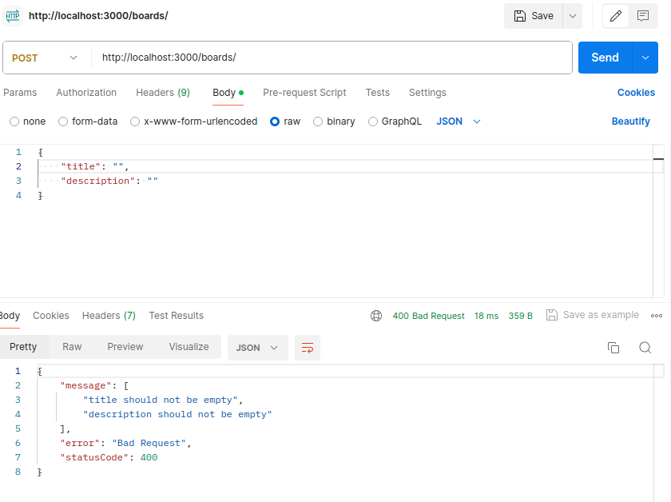
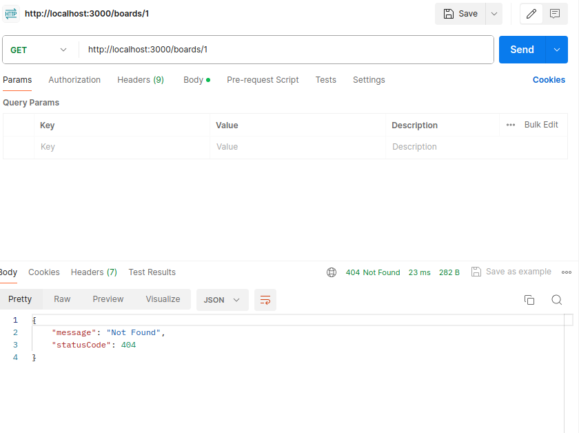
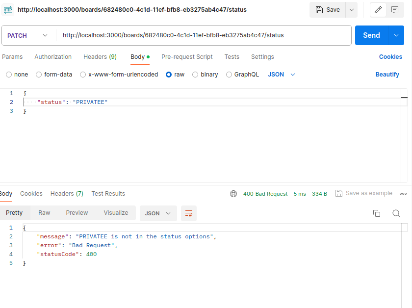

# Section 4. Pipe 이용

## NestJS Pipes

파이프란 `@Injectable()` 데코레이터로 데코레이션된 클래스이다. 파이프는 **data transformation**, **data validation**을 위해 사용된다. 파이프는 컨트롤러의 라우터에 의해 처리되는 인수에 대해 작동한다.

NestJS는 메서드가 호출되기 직전에 파이프를 삽입하고, 파이프는 메서드로 향하는 인수를 수신한 뒤 이에 대해 작동한다.



### Data transformation

Data transformation이란 입력 데이터를 원하는 형식으로 변환하는 것이다. 예를 들어 숫자가 문자열 형식으로 전달된다면 이를 숫자로 파싱하는 것이다.

### Data validation

Data validation이란 입력 데이터를 평가하고 유효한 경우 변경되지 않은 상태로 전달하고, 유효하지 않으면 예외를 발생시키는 것이다. 예를 들어 형식에 맞는 이름이 입력되었을 경우 예외를 발생시킨다.

- - -

파이프는 위의 두 가지 경우 모두에서 라우트 핸들러가 처리하는 인수에 대해 작동한다.

### Pipe 사용하는 법(Binding Pipes)

파이프를 사용하는 방법은 다음의 세 가지로 나누어진다.

- Handler-level pipes
- Parameter-level pipes
- Global-level pipes

#### Handler-level pipes

핸들러에 `@UsePipes()` 데코레이터를 사용해 파이프를 사용할 수 있다. 이 파이프는 모든 파라미터에 적용이 된다.

#### Parameter-level pipes

핸들러의 파라미터의 `@Body()` 등에 파이프를 인자로 전달하여 파이프를 사용할 수 있다. 이 파이프는 일부 파라미터에만 적용이 된다.

#### Global-level pipes

애플리케이션 레벨의 파이프이다. **main.ts**에서 `app.useGlobalPipes()` 메서드로 사용할 수 있다. 이 파이프는 클라이언트로부터 들어오는 모든 요청에 대해 적용된다.

### Built-in pipes

NestJS는 기본적으로 다음과 같은 6가지의 내장 파이프를 제공한다.

- ValidationPipe
- ParseIntPipe
- ParseBoolPipe
- ParseArrayPipe
- ParseUUIDPipe
- DefaultValuePipe

이름을 통해 역할을 짐작할 수 있으며, 이 중 `ParseIntPipe`를 사용하는 예시는 다음과 같다. 예를 들어 파라미터 값으로 숫자가 와야 하는 핸들러가 있다고 하자.

```
...
@Get(:id)
findOne(@Param('id', ParseIntPipe) id: number) {
    ...
}
...
```

그러면 이렇게 `@Param()` 데코레이터의 인자로 직접 파이프를 전달하여 유효성 검사를 할 수 있다.

## 파이프를 이용한 유효성 검사

이번에는 게시물 생성 시 유효성 검사를 해보자. 지금은 게시물 생성 시 title, description에 빈 문자열을 보내도 게시물 생성이 된다. 이 부분을 수정할 것이다.

먼저 `class-validator`, `class-transformer` 두 가지의 모듈이 필요하므로 다음과 같이 설치한다.

```
$ npm i class-validator class-transformer --save
```

그리고 공식 문서(https://github.com/typestack/class-validator#manual-validation)를 참고하여 파이프를 작성한다.

**src/boards/dto/create-board.dto.ts**
```
import { IsNotEmpty } from 'class-validator';

export class CreateBoardDto {
  @IsNotEmpty()
  title: string;

  @IsNotEmpty()
  description: string;
}
```

DTO에 유효성 검사 데코레이터를 적용했다면 컨트롤러에서 실제로 파이프를 사용하도록 설정한다.

**src/boards/boards.controller.ts**
```
...
  @Post()
  @UsePipes(ValidationPipe)
  createBoard(@Body() createBoardDto: CreateBoardDto): Board {
    return this.boardsService.createBoard(createBoardDto);
  }
...
```

내장 파이프인 `ValidationPipe`를 사용하기 위해 DTO를 데코레이션하고 이를 컨트롤러에 적용하였다. 이제 서버를 
실행하고 Postman을 사용해 빈 문자열을 데이터로 보내보자.



빈 문자열 전송 시 서버가 예외를 발생시키는 것을 확인할 수 있다.

## 특정 게시물이 조회되지 않는 경우 결과 처리

현재는 존재하지 않는 ID를 사용해 게시물을 조회하는 경우 어떠한 오류도 반환하지 않고 있다. 이때 오류를 표시해주고자 한다면 예외 인스턴스를 생성해 사용해 주어야 한다. 서비스 로직을 다음과 같이 수정하자.

**src/boards/boards.service.ts**
```
...
  getBoardById(id: string): Board {
    const found = this.boards.find((board) => board.id === id)
    if (!found) {
      throw new NotFoundException();
    }

    return found;
  }
...
```

이제 존재하지 않는 ID로 조회 요청을 보내면 다음과 같이 오류가 응답된다.



`NotFoundException`은 NestJS가 기본적으로 제공해 주는 것이다. 또한 인자로 다음과 같이 정확한 오류 메시지를 전달할 수도 있다.

```
...
      throw new NotFoundException(`Cannot find a Board with id ${id}`);
...
```

## 존재하지 않는 게시물을 삭제하려 할 때 결과 처리

앞서 존재하지 않는 게시물을 조회하려 할 때의 결과를 처리했다면, 이번에는 존재하지 않는 게시물을 삭제하려 할 때의 결과를 처리한다. 이번에도 서비스 로직을 다음과 같이 수정한다.

**src/boards/boards.service.ts**
```
...
  deleteBoard(id: string): void {
    const found = this.getBoardById(id);
    this.boards = this.boards.filter((board) => board.id !== found.id);
  }
...
```

예외 처리가 이미 `getBoardById()`에서 되었으므로 `deleteBoard()`에서는 이를 그냥 사용하기만 하면 된다.

## 커스텀 파이프를 이용한 유효성 검사

지금까지는 NestJS에서 기본적으로 제공하는 내장 파이프를 사용했지만, 이것 외에도 직접 정의하여 사용할 수 있는 커스텀 파이프도 있다.

### 커스텀 파이프 구현 방법

먼저 `PipeTransform`이란 인터페이스를 구현해 주어야 한다. 이것은 모든 파이프에서 구현해야 한다. 그리고 이와 함께 NestJS가 인자를 처리하기 위해 사용하는 `transform()`이란 메서드가 필요하다.

### transform() 메서드

이 메서드는 다음과 같은 두 개의 파라미터를 가진다.

- 처리가 된 인자의 값
- 인자에 대한 메타데이터를 포함한 객체

메서드에서 반환된 값은 라우트 핸들러로 전달된다. 만약 처리 중 예외가 발생한다면 즉시 클라이언트에게 응답이 전송되고 로직이 마무리된다.

커스텀 파이프를 직접 생성하고 전달되는 값을 콘솔에 출력해 보자.

**src/boards/pipes/board-status-validation.pipe.ts**
```
import { ArgumentMetadata, PipeTransform } from '@nestjs/common';

export class BoardStatusValidationPipe implements PipeTransform {
  transform(value: any, metadata: ArgumentMetadata) {
    console.log(value);
    console.log(metadata);

    return value;
  }
}
```

**src/boards/boards.controller.ts**
```
...
  @Patch('/:id/status')
  updateBoardStatus(
    @Param('id') id: string,
    @Body('status', BoardStatusValidationPipe) status: BoardStatus,
  ) {
    return this.boardsService.updateBoardStatus(id, status);
  }
...
```

게시물을 생성하고 status 변경을 요청하면 다음과 같은 값이 콘솔에 출력된다.

```
PRIVATE
{ metatype: [Function: String], type: 'body', data: 'status' }
```

이렇게 `transform()` 메서드의 두 인자가 나타내는 값을 출력해 보았다.

### 커스텀 파이프로 실제 기능 구현하기

이제 실제로 사용될 커스텀 파이프를 구현해 보자. status의 값은 PRIVATE 또는 PUBLIC이어야 한다. 그러므로 이 외의 값이 오면 예외를 발생시키는 파이프를 구현할 것이다.

**src/boards/pipes/board-status-validation.pipe.ts**
```
import { BadRequestException, PipeTransform } from '@nestjs/common';
import { BoardStatus } from '../board.model';

export class BoardStatusValidationPipe implements PipeTransform {
  readonly StatusOptions = [BoardStatus.PUBLIC, BoardStatus.PRIVATE];

  private isStatusValid(status: any) {
    const index = this.StatusOptions.indexOf(status);
    return index !== -1;
  }

  transform(value: any) {
    value = value.toUpperCase();

    if (!this.isStatusValid(value)) {
      throw new BadRequestException(`${value} is not in the status options`);
    }

    return value;
  }
}
```

이제 서버를 실행하고 Postman을 사용해 유효하지 않은 요청을 보내보자.



구현한 파이프가 잘 작동됨을 확인할 수 있다.