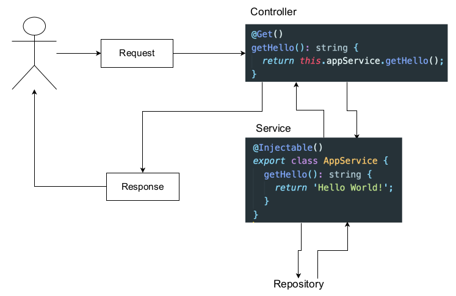

# Section 5. Postgres & TypeORM 연동

## PostgresSQL 설치

docker 환경을 이용해 PostgresSQL 및 pgAdmin을 설치한다.

```
sudo docker pull postgres
sudo docker network create pgnetwork
sudo docker run --name some-postgres -e POSTGRES_PASSWORD=kimyush1n@@ -p 5432:5432 -d postgres
sudo docker run --name some-pgadmin --network pgnetwork -e PGADMIN_DEFAULT_EMAIL=user@domain.com -e PGADMIN_DEFAULT_PASSWORD=yourpassword -p 80:80 -d dpage/pgadmin4
```

설치 이후 컨테이너를 실행하고 http://localhost에 접속하여 pgAdmin에 로그인한 다음 나의 PostgresSQL 컨테이너를 등록해 주면 된다.

## TypeORM(Object Relational Mapping) 소개

TypeORM은 Node.js에서 실행되고 타입스크립트로 작성된 ORM 라이브러리이다. 여러 SQL 데이터베이스를 지원한다. TypeORM은 다음과 같은 특징 및 이점을 갖는다.

- 모델을 기반으로 데이터베이스 테이블을 자동으로 생성한다.
- 데이터베이스를 쉽게 조작할 수 있다.
- 테이블 간의 매핑을 만든다.
- 간단한 CLI 명령을 제공한다.
- 간단한 코딩으로 ORM 프레임워크를 사용하기 쉽다.
- 다른 모듈과 쉽게 통합된다.

## TypeORM 애플리케이션에서 이용하기

애플리케이션에서 TypeORM을 사용하기 위해선 다음과 같은 모듈들을 설치해야 한다.

- **@nestjs/typeorm**: NestJS에서 TypeORM을 사용하기 위한 연동 모듈
- **typeorm**: TypeORM 모듈
- **pg**: Postgres 모듈

NestJS TypeORM 공식 문서: https://docs.nestjs.com/techniques/database

다음과 같은 명령어로 필요한 모듈들을 설치한다.

```
$ npm i pg typeorm @nestjs/typeorm --save
```

### TypeORM 애플리케이션에 연결하기

먼저 TypeORM 설정 파일을 생성한다.

**src/configs/typeorm.config.ts**
```
import { TypeOrmModuleOptions } from '@nestjs/typeorm';
import * as dotenv from 'dotenv';
dotenv.config();

export const typeORMConfig: TypeOrmModuleOptions = {
  // Database type
  type: 'postgres',
  host: 'localhost',
  port: 5432,
  username: 'postgres',
  password: process.env.POSTGRES_PASSWORD,
  database: 'board-app',
  // entities should be loaded for this connection
  entities: [__dirname + '/../**/*.entity.{js,ts}'],
  // be careful to use and do not use in production environment
  synchronize: true,
};
```

그리고 루트 모듈에서 import하도록 설정한다.

**src/app.module.ts**
```
import { Module } from '@nestjs/common';
import { ConfigModule } from '@nestjs/config';
import { BoardsModule } from './boards/boards.module';
import { TypeOrmModule } from '@nestjs/typeorm';
import { typeORMConfig } from './configs/typeorm.config';

@Module({
  imports: [
    ConfigModule.forRoot({
      isGlobal: true,
    }),
    TypeOrmModule.forRoot(typeORMConfig),
    BoardsModule,
  ],
  controllers: [],
  providers: [],
})
export class AppModule {}
```

참고로 Postgres DB 암호를 노출하지 않기 위해서 `dotenv`를 설치 및 기초적인 설정을 진행하였고, 해당 내용은 생략하였다.

## 게시물을 위한 Entity 생성하기

ORM 없이 데이터베이스 테이블을 생성하려면 `CREATE TABLE board ( ... )`과 같은 쿼리가 필요할 것이다. 그러나 TypeORM을 사용할 때는 클래스가 테이블로 자동 변환되기 때문에 다음과 같이 클래스를 생성한 후 그 안에 컬럼들을 정의해주면 된다.

**src/boards/board.entity.ts**
```
import { BaseEntity, Column, PrimaryGeneratedColumn } from 'typeorm';
import { BoardStatus } from './board.model';

export class Board extends BaseEntity {
  @PrimaryGeneratedColumn()
  id: number;

  @Column()
  title: string;

  @Column()
  description: string;

  @Column()
  status: BoardStatus;
}
```

- **@Entity()**: Board 클래스가 엔티티임을 나타내는 데 사용되는 데코레이터이다. `CREATE TABLE board`에 해당한다.
- **@PrimaryGeneratedColumn()**: 해당 컬럼이 기본 키임을 나타낸다.
- **@Column()**: 해당 컬럼이 일반적인 컬럼임을 나타낸다.

TypeORM은 데이터베이스에 Board 엔티티에 해당하는 테이블을 자동으로 생성하고 board로 명명한다.

## Repository 생성하기

리포지토리는 엔티티 개체와 함께 작동하며 엔티티에 대한 CRUD 작업을 처리하는 하나의 계층이다.

TypeORM Repository 공식 문서: http://typeorm.delightful.studio/classes/_repository_repository_.repository.html



기존에 서비스 계층에서 처리하였던 작업 중 데이터베이스와 관련된 작업을 Repository 계층으로 분리하면 된다. 다음과 같이 리포지토리 파일을 생성한다.

**src/boards/board.repository.ts**
```
import { Repository } from 'typeorm';
import { Board } from './board.entity';
import { Injectable } from '@nestjs/common';

@Injectable()
export class BoardRepository extends Repository<Board> {}
```

리포지토리를 사용하기 위해 모듈에서 import해준다.

**src/boards/boards.module.ts**
```
import { Module } from '@nestjs/common';
import { BoardsController } from './boards.controller';
import { BoardsService } from './boards.service';
import { TypeOrmModule } from '@nestjs/typeorm';
import { Board } from './board.entity';

@Module({
  imports: [TypeOrmModule.forFeature([Board])],
  controllers: [BoardsController],
  providers: [BoardsService],
})
export class BoardsModule {}
```

기존의 강의에서는 `EntityRepository`를 사용하고 있지만, TypeORM 0.3 이후부터는 이를 지원하고 있지 않기 때문에 `Repository`를 사용하는 방법을 위주로 작성한다.