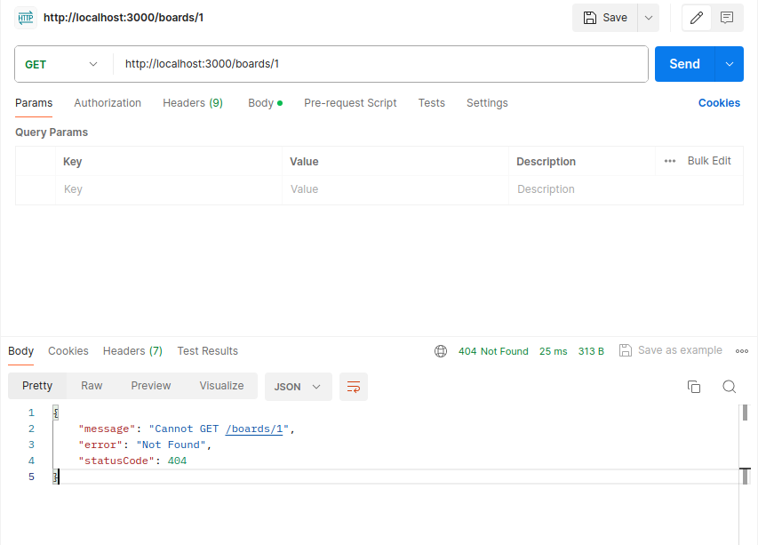
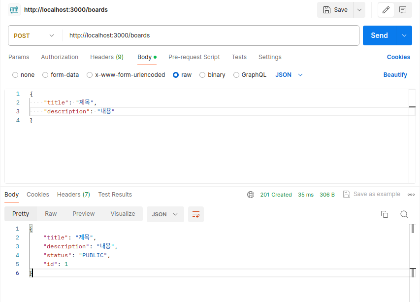
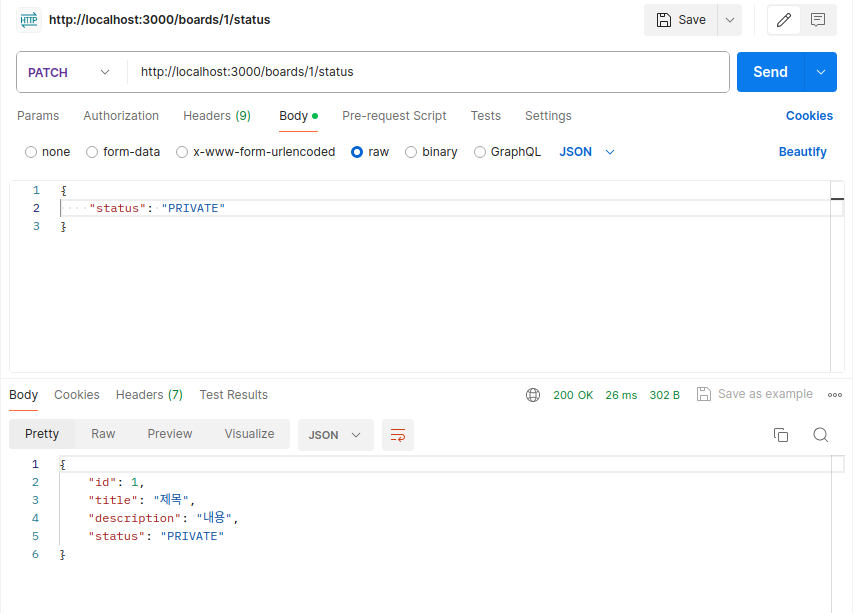

# Section 6. 데이터베이스를 이용한 CRUD 구현

## 데이터베이스를 위한 소스 코드 정리

데이터베이스 연동 후 CRUD를 구현하기 위해 기존에 작성한 메모리 기반의 소스 코드를 정리해야 한다. 그러므로 기존에 작성하였던 몇몇 부분을 삭제하거나 주석 처리해야 한다.

- 서비스와 컨트롤러 로직을 모두 주석 처리한다.
- 서비스에서 board 배열과 uuid 부분을 삭제한다.
- 엔티티를 사용하므로 board 모델에 있는 BoardInterface는 삭제한다.
- BoardStatus는 삭제하지 않고 파일 이름을 board-status.enum.ts로 변경한다.

## ID를 이용해 특정 게시물 조회하기

TypeORM을 사용해 Repository 패턴을 사용하기 위해서 서비스에 DI를 해 주어야 한다. 이를 위해 서비스 코드를 수정한다.

**src/boards/boards.service.ts**
```
...
constructor(private readonly boardRepository: BoardRepository) {}
...
```

생성자를 사용해 의존성을 주입한다.

### 서비스에서 getBoardById 메서드 생성하기

데이터베이스 작업을 구현하기 위해 다음과 같은 것들을 해야 한다.

- TypeORM에서 제공하는 `findOne()` 메서드 사용하기
- async/await 문법을 사용해 비동기 데이터베이스 작업을 위해 대기하기

먼저 리포지토리 계층에서 TypeORM의 `findOne()` 메서드를 사용해 `getBoardById()` 메서드를 정의한다.

**src/boards/board.repository.ts**
```
...
  async getBoardById(id: number): Promise<Board> {
    return this.repository.findOne({ where: { id } });
  }
...
```

주석 처리하였던 서비스 계층의 `getBoardById()` 메서드를 다음과 같이 재정의한다.

**src/boards/boards.service.ts**
```
...
  async getBoardById(id: number): Promise<Board> {
    const found = await this.boardRepository.getBoardById(id);
    
    if (!found) {
      throw new NotFoundException(`Cannot find a Board with id ${id}`);
    }

    return found;
  }
...
```

마지막으로 컨트롤러에 연결해준다.

**src/boards/boards.controller.ts**
```
...
  @Get()
  getBoardById(@Param('id') id: number): Promise<Board> {
    return this.boardsService.getBoardById(id);
  }
...
```

아직 데이터베이스에 저장된 게시물은 없지만, Postman을 사용해 게시물을 조회하는 것이 가능한지 확인해 보자.



잘 작동함을 확인할 수 있다. 데이터베이스 연동 이후의 작업 과정은 다음과 같다.

1. 필요한 데이터베이스 로직을 리포지토리 계층에 정의한다.
2. 서비스 계층에서 리포지토리 계층에 정의된 메서드를 사용하여 비즈니스 로직을 구현한다.
3. 컨트롤러 계층에서는 서비스 계층의 메서드를 이용하여 클라이언트의 요청을 처리하고 응답한다.

## 게시물 생성하기

이번에는 데이터베이스를 연동하여 게시물을 생성하는 로직을 구현한다.

**src/boards/board.repository.ts**
```
...
  async createBoard(createBoardDto: CreateBoardDto): Promise<Board> {
    const { title, description } = createBoardDto;

    const board = this.repository.create({
      title,
      description,
      status: BoardStatus.PUBLIC,
    });

    await this.repository.save(board);

    return board;
  }
...
```

먼저 리포지토리 계층에서 데이터베이스에 `CreateBoardDto` 타입의 데이터를 사용해 새로운 행을 추가하는 메서드를 정의한다.

**src/boards/boards.service.ts**
```
...
  async createBoard(createBoardDto: CreateBoardDto): Promise<Board> {
    return this.boardRepository.createBoard(createBoardDto);
  }
...
```

서비스 계층에서는 리포지토리 계층의 메서드를 사용한다. 

**src/boards/boards.controller.ts**
```
...
  @Post()
  @UsePipes(ValidationPipe)
  createBoard(@Body() createBoardDto: CreateBoardDto): Promise<Board> {
    return this.boardsService.createBoard(createBoardDto);
  }
...
```

컨트롤러 계층에서는 서비스 계층의 로직을 호출한다.

이제 Postman을 사용해 새롭게 구현한 기능을 테스트해 보자.



게시물이 잘 생성되었음을 확인할 수 있다.

## 게시물 삭제하기

이번에는 데이터베이스를 연동하여 게시물을 삭제하는 기능을 구현한다. 삭제를 위한 TypeORM 메서드는 다음과 같은 것들이 존재한다.

- **remove()**: 존재하는 데이터를 삭제해야 한다. 존재하지 않는 데이터를 삭제하려 하면 404 오류가 발생한다. 또한 데이터가 존재하는지 확인하고, 삭제하는 과정에서 각각 데이터베이스 조회가 발생하여 두 번 조회하게 된다.
- **delete()**: 데이터가 존재하지 않으면 아무것도 하지 않고, 존재하면 삭제한다.

**src/boards/board.repository.ts**
```
...
  async deleteBoard(id: number): Promise<void> {
    const result = await this.repository.delete({ id });

    if (result.affected === 0) {
      throw new NotFoundException(`Cannot find a Board with id ${id}`);
    }
  }
...
```

리포지토리 계층에서 id를 기반으로 데이터베이스에서 데이터를 삭제한다. 삭제 결과로 반환되는 객체에서 `affected` 속성의 값이 0이면 게시물이 존재하지 않았다는 의미이므로 예외를 처리하도록 한다.

**src/boards/boards.service.ts**
```
...
  async deleteBoard(id: number): Promise<void> {
    return this.boardRepository.deleteBoard(id);
  }
...
```

**src/boards/boards.controller.ts**
```
...
  @Delete()
  deleteBoard(@Param('id', ParseIntPipe) id: number): Promise<void> {
    return this.boardsService.deleteBoard(id);
  }
...
```

구현한 리포지토리 계층 로직을 서비스와 컨트롤러 계층에서 응용한다.

## 게시물 상태 업데이트하기

이번에는 데이터베이스를 연동하여 게시물의 상태를 업데이트하는 로직을 구현한다.

**src/boards/board.repository.ts**
```
...
  async updateBoardStatus(board: Board, status: BoardStatus): Promise<Board> {
    board.status = status;
    return this.repository.save(board);
  }
...
```

**src/boards/boards.service.ts**
```
...
  async updateBoardStatus(id: number, status: BoardStatus): Promise<Board> {
    const board = await this.boardRepository.getBoardById(id);
    return this.boardRepository.updateBoardStatus(board, status);
  }
...
```

**src/boards/boards.controller.ts**
```
...
  @Patch('/:id/status')
  updateBoardStatus(
    @Param('id', ParseIntPipe) id: number,
    @Body('status', BoardStatusValidationPipe) status: BoardStatus,
  ): Promise<Board> {
    return this.boardsService.updateBoardStatus(id, status);
  }
...
```



Postman으로 구현한 기능을 테스트한 결과 잘 작동함을 확인할 수 있다.

## 모든 게시물 조회하기

마지막으로 구현할 데이터베이스 CRUD 기능은 모든 게시물을 가져오는 기능이다. 이것은 TypeORM의 `find()` 메서드에 아무 인자도 전달하지 않음으로써 모든 조건에 해당하는(즉, 존재하는 모든) 게시물을 조회할 수 있다.

**src/boards/board.repository.ts**
```
...
  async getAllBoards(): Promise<Board[]> {
    return this.repository.find();
  }
...
```

**src/boards/boards.service.ts**
```
...
  async getAllBoards(): Promise<Board[]> {
    return this.boardRepository.getAllBoards();
  }
...
```

**src/boards/boards.controller.ts**
```
...
  @Get()
  getAllBoards(): Promise<Board[]> {
    return this.boardsService.getAllBoards();
  }
...
```