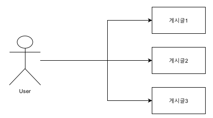

# Section 8. 게시물 접근 권한 처리

## 사용자와 게시물 간 관계 형성

현재는 사용자와 게시물 간 관계가 없기 때문에 어떤 사용자가 게시물을 작성했는지를 알 수도 없고, 그러한 동작이 정의되어 있지도 않다. 그렇기 때문에 데이터베이스에 새로운 관계를 정의할 것이다.

하나의 사용자는 여러 게시물을 작성할 수 있다. 하나의 게시물은 하나의 작성자(사용자)만 갖는다. 그러므로 이러한 관계는 일대다 관계이다.



두 테이블 간 관계를 반영하기 위해 엔티티 코드를 수정한다.

**src/auth/user.entity.ts**
```
import { Board } from "src/boards/board.entity";
import { BaseEntity, Column, Entity, OneToMany, PrimaryGeneratedColumn, Unique } from "typeorm";

@Entity()
@Unique(['username'])
export class User extends BaseEntity {
  @PrimaryGeneratedColumn()
  id: number;

  @Column()
  username: string;

  @Column()
  password: string;

  @OneToMany(type => Board, board => board.user, { eager: true })
  boards: Board[];
}
```

**src/boards/board.entity.ts**
```
import { BaseEntity, Column, Entity, ManyToOne, PrimaryGeneratedColumn } from 'typeorm';
import { BoardStatus } from './board-status.enum';
import { User } from 'src/auth/user.entity';

@Entity()
export class Board extends BaseEntity {
  @PrimaryGeneratedColumn()
  id: number;

  @Column()
  title: string;

  @Column()
  description: string;

  @Column()
  status: BoardStatus;

  @ManyToOne(type => User, user => user.boards, { eager: false })
  user: User;
}
```

- **type**: 해당 테이블의 타입이다.
- **inverseSide(ex: user => user.boards)**: 다른 테이블에서 이 테이블의 요소에 접근하는 방법을 명시한다.
- **Option**: `eager` 옵션을 true로 설정하면 해당 테이블의 데이터를 조회할 때 연결된 테이블의 데이터도 함께 조회된다.

## 게시물 생성 시 사용자 정보 포함해주기

이전에 사용자와 게시물 간 관계를 형성해 주었기 때문에 이번에는 게시물 생성 시 사용자 정보를 포함해 주는 기능을 구현한다

기존에 구현한 기능을 리팩토링하는 것이기 때문에 컨트롤러 계층부터 순서대로 로직을 개선해 나간다.

**src/boards/boards.controller.ts**
```
...
  @Post()
  @UsePipes(ValidationPipe)
  createBoard(
    @Body() createBoardDto: CreateBoardDto,
    @GetUser() user: User,
  ): Promise<Board> {
    return this.boardsService.createBoard(createBoardDto, user);
  }
...
```

다음으로는 서비스 계층 로직을 리팩토링한다.

**src/boards/boards.service.ts**
```
...
  async createBoard(
    createBoardDto: CreateBoardDto,
    user: User,
  ): Promise<Board> {
    return this.boardRepository.createBoard(createBoardDto, user);
  }
...
```

마지막으로 리포지토리 계층 로직을 리팩토링한다.

**src/boards/board.repository.ts**
```
...
  async createBoard(
    createBoardDto: CreateBoardDto,
    user: User,
  ): Promise<Board> {
    const { title, description } = createBoardDto;

    const board = this.repository.create({
      title,
      description,
      status: BoardStatus.PUBLIC,
      user,
    });

    await this.repository.save(board);
    delete board.user;

    return board;
  }
...
```

Board 객체를 반환할 때 보안을 위해 사용자 정보를 제거하여 보낸 것에 주목하자.

## 사용자가 작성한 게시물만 조회하기

현재는 게시물을 조회할 때 모든 게시물을 가져오고 있지만, 비즈니스 요구사항상 모든 게시물을 조회하는 것이 사용자가 작성한 모든 게시물을 의미하는 것이라고 하자. 이번에는 이러한 비즈니스 요구사항을 충족하는 기능을 구현한다. 우선 로그인한 후 게시물을 몇 개 작성하고 시작하자.

컨트롤러 계층부터 순서대로 리팩토링해 나간다.

**src/boards/boards.controller.ts**
```
...
  @Get()
  getAllBoards(@GetUser() user: User): Promise<Board[]> {
    return this.boardsService.getAllBoards(user);
  }
...
```

다음은 서비스 계층의 리팩토링이다.

**src/boards/boards.service.ts**
```
...
  async getAllBoards(user: User): Promise<Board[]> {
    return this.boardRepository.getAllBoards(user);
  }
...
```

마지막으로 리포지토리 계층을 리팩토링한다.

**src/boards/board.repository.ts**
```
...
  async getAllBoards(user: User): Promise<Board[]> {
    const query = this.repository.createQueryBuilder('board');

    query.where('board.userId = :userId', { userId: user.id });

    const boards = await query.getMany();

    return boards;
  }
...
```

## 사용자가 작성한 게시물 삭제하기

이번에는 사용자가 작성한 게시물을 삭제하는 기능을 구현한다. 컨트롤러 계층부터 리포지토리 계층까지 순서대로 리팩토링해 나가자.

**src/boards/boards.controller.ts**
```
...
  @Delete()
  deleteBoard(
    @Param('id', ParseIntPipe) id: number,
    @GetUser() user: User,
  ): Promise<void> {
    return this.boardsService.deleteBoard(id, user);
  }
...
```

**src/boards/boards.service.ts**
```
...
  async deleteBoard(id: number, user: User): Promise<void> {
    return this.boardRepository.deleteBoard(id, user);
  }
...
```

**src/boards/board.repository.ts**
```
...
  async deleteBoard(id: number, user: User): Promise<void> {
    const result = await this.repository.delete({ id, user });

    if (result.affected === 0) {
      throw new NotFoundException(`Cannot find a Board with id ${id}`);
    }
  }
...
```